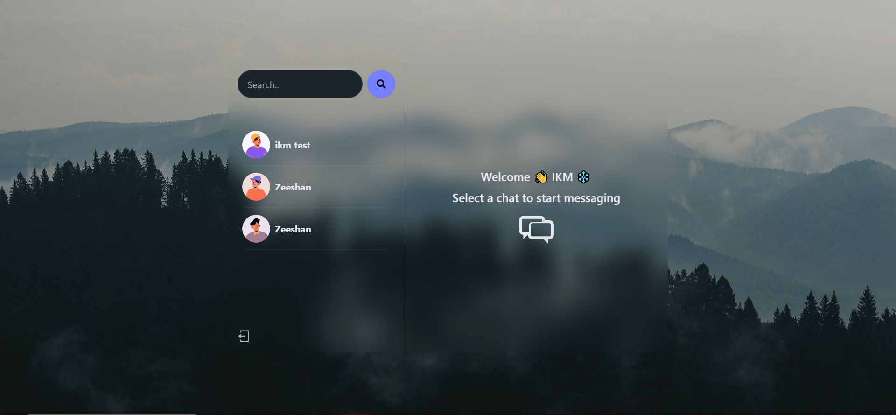
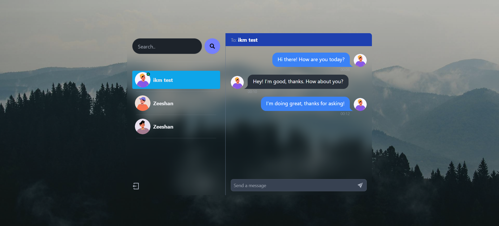
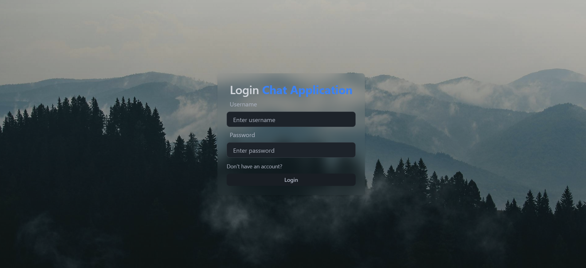
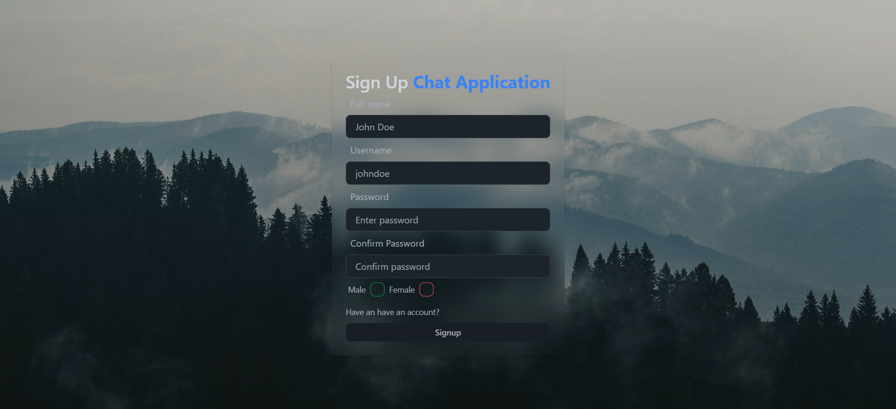

# Chat Application

Welcome to the Chat Application project! This application allows users to send messages to each other in real-time, manage conversations, and more.


## Table of Contents

- [Chat Application](#chat-application)
  - [Table of Contents](#table-of-contents)
  - [Project Overview](#project-overview)
  - [Features](#features)
  - [Technologies Used](#technologies-used)
  - [Setup Instructions](#setup-instructions)
    - [Prerequisites](#prerequisites)
    - [Backend Setup](#backend-setup)
    - [Frontend Setup](#frontend-setup)
  - [Live Demo](#live-demo)
  - [Screenshots](#screenshots)
    - [Home](#home)
    - [Chat page](#chat-page)
    - [Login](#login)
    - [Signup](#signup)

## Project Overview

The Chat Application is built using a modern stack including **React**, **Node.js**, **Express**, **MongoDB**, and **Socket.IO**. It allows users to:

- Register and authenticate.
- View online users and their statuses.
- Select a user to start a conversation.
- Send and receive real-time messages.
- View conversation history.
- Logout securely.

The frontend is built with **React** and **Tailwind CSS** for responsive and modern UI components. The backend is powered by **Node.js** and **Express**, providing a RESTful API for user authentication, message handling, and socket-based real-time communication via **Socket.IO**.

## Features

- **User Authentication**: Users can sign up, log in, and log out securely.
- **Real-time Messaging**: Send and receive messages in real-time using **Socket.IO**.
- **Conversation Management**: View and select conversations to send messages.
- **Online Status**: Display online status of users in real-time.
- **Responsive Design**: Modern UI with responsive layouts using **Tailwind CSS**.

## Technologies Used

- **Frontend**:
  - React
  - Tailwind CSS
  - React Hot Toast (for notifications)
  - Socket.IO Client (for real-time messaging)

- **Backend**:
  - Node.js
  - Express
  - MongoDB (with Mongoose)
  - Socket.IO (for real-time messaging)

## Setup Instructions

To run the Chat Application locally, follow these steps:

### Prerequisites

- Node.js (v14.x or later)
- MongoDB (installed and running)

### Backend Setup

1. Clone the repository:

   ```bash
   git clone https://github.com/ishwar-ikm/Chat-Application
   cd chat-application
   ```

2. Install dependencies:

   ```bash
   npm install
   ```

3. Create a `.env` file in the `backend` directory with the following environment variables:

   ```
   PORT=5000
   MONGO_URI=your_mongodb_connection_string
   JWT_SECRET=your_jwt_secret
   ```

4. Start the backend server:

   ```bash
   npm run server
   ```

   This will start the backend server at `http://localhost:5000`.

### Frontend Setup

1. Navigate to the `frontend` directory:

   ```bash
   cd frontend
   ```

2. Install dependencies:

   ```bash
   npm install
   ```

3. Start the frontend development server:

   ```bash
   npm run dev
   ```

   This will start the frontend server and open the application in your default web browser at `http://localhost:5173`.

## Live Demo

Check out the live demo of our Chat Application:

[Chat Application Live](https://chat-application-klfk.onrender.com/)

## Screenshots
### Home

### Chat page

### Login

### Signup

